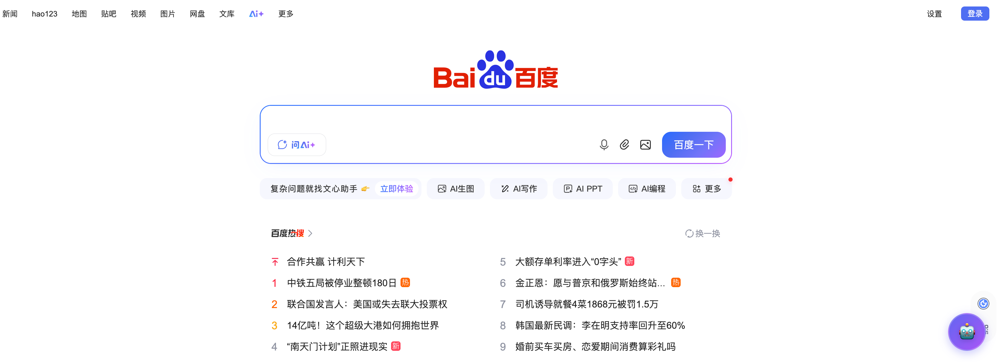
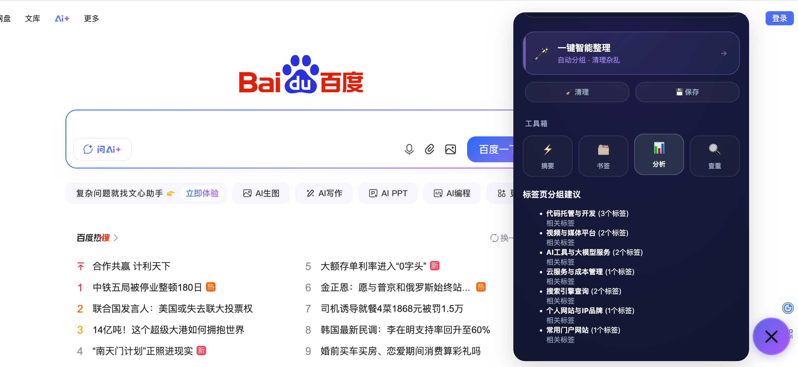
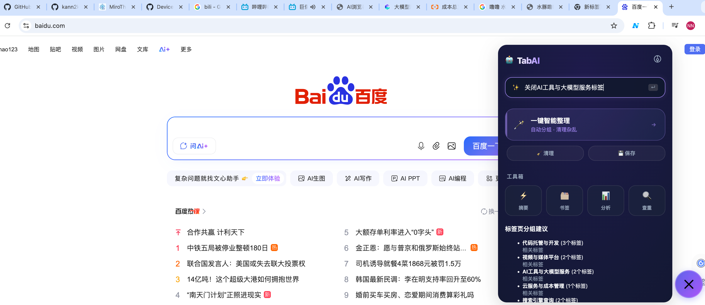
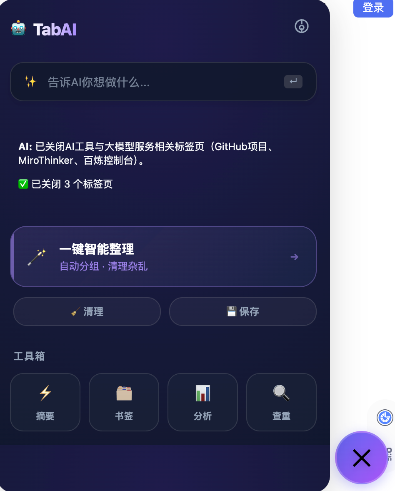
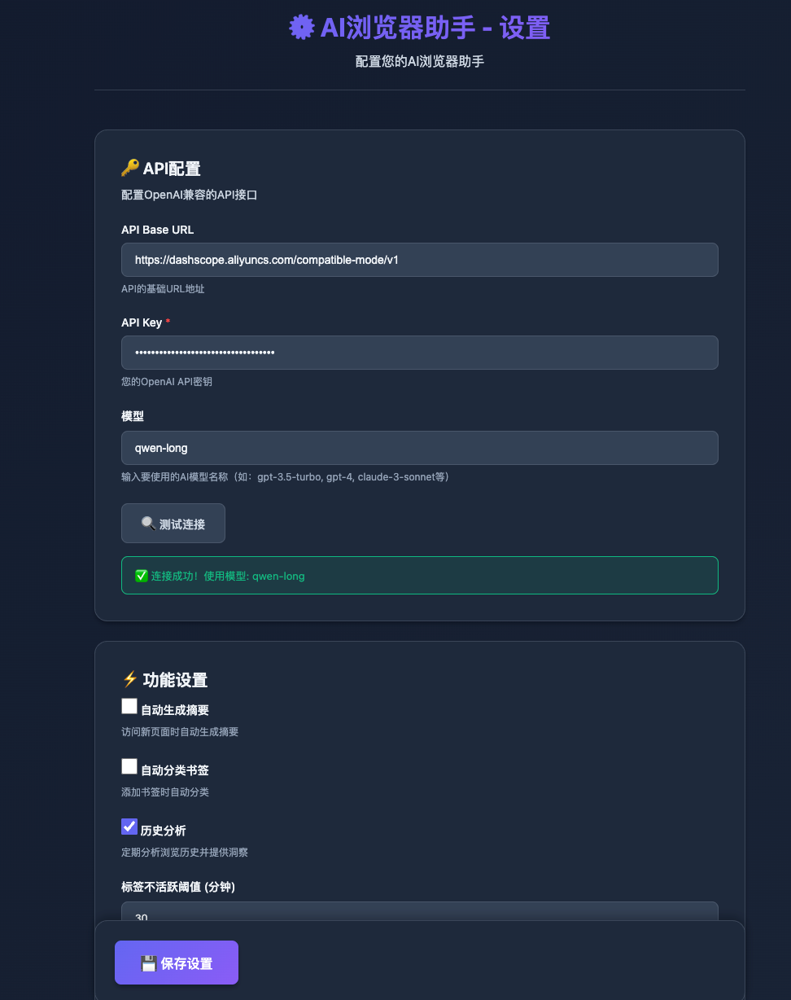

# TabAI - Smart Browser Assistant (Chrome & Safari)

[English](#english) | [中文](#chinese)

<a name="english"></a>

**TabAI** is an AI assistant that brings your browser to life. It not only chats with you but also organizes messy tabs, automatically classifies bookmarks, analyzes browsing habits, and even generates instant summaries of web content.


> ✨ **Core Feature**: Designed with a global floating ball, it stays in the bottom right corner of any webpage like a co-pilot, always ready to help without interrupting your browsing experience.

## 🌟 Key Features

### 🤖 Global AI Floating Ball

- **Omnipresent**: Click the 🤖 icon in the bottom right corner of any webpage to wake it up.
- **Instant Response**: Chat directly within the floating ball.
- **Cross-Tab Sync**: Your conversation state automatically follows you no matter which page you switch to (🚧 Deep context memory optimization in progress).

### 📑 Smart Tab Management

- **One-Click Grouping**: AI analyzes your open tabs and automatically groups them by topic.
- **Auto-Cleanup**: Smartly identifies tabs you haven't viewed in a long time and helps you declutter.

- **🚧 Semantic Search (In Development)**: "Help me organize coding-related tabs" — natural language commands like this are in development.


### 🔖 Native Bookmark Enhancement
- **AI Classification**: Stop worrying about which folder to save bookmarks in; AI automatically categorizes them for you.
- **Duplicate Detection**: One-click scan to clean up duplicate links.

### 📊 Browsing Insight
- **Productivity Analysis**: See where your time goes each day (Work vs. Leisure).
- **Interest Graph**: Generate personal interest keywords based on your browsing history.

---

## 🗺️ Roadmap

We are actively developing the following features and welcome contributions!

- [ ] **Deep Context Memory**: Allow AI to fully remember conversation history (currently supports recent context).
- [ ] **Natural Language Control**: Support complex commands like "Move all React-related tabs to the front".
- [ ] **Tab Drag & Drop**: Drag to reorder tabs directly in the floating panel.
- [ ] **Bookmark Enhancement**: AI classification and duplicate cleanup.
- [ ] **Multi-Device Sync**: Sync preferences via cloud.

## ✨ Contribute

This is an open-source project, and we welcome you to help improve it!

- **🌟 Star**: If you find this project interesting, please give us a Star!
- **🐞 Submit Issue**: Found a bug or have a new idea? Feel free to submit an Issue.
- **🤝 Pull Request**: Modify the code and submit a PR to become a contributor.

---

## 🚀 Installation Guide

### Chrome / Edge (Recommended)

1. **Download Source**:
   ```bash
   git clone https://github.com/kann2kagg/tab-ai.git
   ```

2. **Load Extension**:
   - **Chrome**: Open `chrome://extensions/` -> Enable **"Developer mode"** in the top right.
   - **Edge**: Open `edge://extensions/` -> Enable **"Developer mode"**.
   - Click **"Load unpacked"** -> Select the `safari-ai-extension` folder.

### macOS Safari

> ⚠️ **Note**: Modern Safari (v14+) no longer supports loading `.json` extensions directly. You must use Xcode to convert it into a native app.

1. **Ensure Xcode is installed** (Download from App Store).
2. **Run Conversion Command**:
   Open Terminal and run:
   ```bash
   xcrun safari-web-extension-converter /path/to/safari-ai-extension
   ```
3. **Run Project**:
   - Xcode will automatically open the new project.
   - Click the **Run (▶)** button in the top left.
   - Enable **TabAI** in Safari Preferences -> **Extensions**.

---

## ⚙️ Quick Start

1. **Configure AI Model**:
   - The settings page will open automatically after installation (or right-click Floating Ball -> Settings).
   - Enter your OpenAI API Key (Supports GPT-3.5/4, Claude, or any OpenAI-compatible local LLM).
   

2. **Start Using**:
   - Open any webpage and click the **TabAI** floating ball in the bottom right corner.
   - Try saying: *"Help me organize these coding tabs"*.

---

## 🔒 Privacy Statement

We understand the importance of privacy. TabAI is designed with **"Local First"** principles:

- **0 Data Upload**: Your browsing history and bookmarks are **processed only locally** and will never be uploaded to our servers.
- **Transparent Interaction**: Text data is sent to your configured API provider (e.g., OpenAI) only when you explicitly ask AI to summarize or classify.
- **Open Source**: This project is completely open source, so you can audit all code logic.

## 🛠️ Tech Stack

- **Manifest V3**: Compliant with the latest browser extension security standards.
- **Vanilla JS**: Zero-dependency native development for extreme lightweight and fast startup.
- **Shadow DOM**: The floating ball uses Shadow DOM technology to ensure styles do not pollute webpages.

---

**TabAI** - Make Browsing Smart Again.

---
---

<a name="chinese"></a>

# TabAI - 智能浏览器助手 (Safari & Chrome)

**TabAI** 是一个能够让你的浏览器"活"过来的AI助手。它不仅能和你聊天，还能帮你整理杂乱的标签页、自动分类书签、分析浏览习惯，甚至直接对网页内容进行即时摘要。


> ✨ **核心特色**: 全局悬浮球设计，像驾驶副手一样常驻在网页右下角，随时待命，不打断你的浏览体验。

## 🌟 主要功能

### 🤖 全局AI悬浮球

- **无处不在**: 在任意网页右下角点击 🤖 图标即可唤醒。
- **即时响应**: 悬浮球内直接对话。
- **跨标签同步**: 无论切换到哪个页面，你的对话状态都会自动跟随 (🚧 上下文深度记忆优化中)。

### 📑 智能标签页管理

- **一键分组**: AI自动分析已打开的一堆标签页，按主题自动归类。
- **自动清理**: 智能识别"太久没看且不重要"的标签页，帮你从混乱中解脱。

- **🚧 语义搜索 (开发中)**: "帮我把编程相关的标签页整理一下" —— 这种自然语言指令正在开发中。


### 🔖 原生书签增强
- **AI分类**: 存书签时不再纠结放哪个文件夹，AI自动帮你归类。
- **重复检测**: 一键扫描并清理重复收藏的链接。

### 📊 浏览行为洞察
- **生产力分析**: 看看你每天的时间都花在哪了（工作 vs 摸鱼）。
- **兴趣图谱**: 基于浏览历史生成你的个人兴趣关键词。

---

## 🗺️ 开发路线图 (Roadmap)

我们正在积极开发以下功能，欢迎贡献代码！

- [ ] **深度上下文记忆**: 让AI完整记住历史对话（目前还不支持最近）。
- [ ] **自然语言控车**: 支持 "把所有关于React的标签移到最前面" 这种复杂指令。
- [ ] **标签页拖拽排序**: 在悬浮面板中直接拖拽调整顺序。
- [ ] **书签增强**: AI自动帮你归类，一键扫描并清理重复收藏的链接。
- [ ] **多设备同步**: 通过云端同步你的偏好设置。

## ✨ 参与贡献

这是一个开源项目，非常欢迎您参与完善它！

- **🌟 Star 鼓励**: 如果您觉得这个项目有趣，请在右上角点个 Star！
- **🐞 提交 Issue**: 发现 Bug 或有新点子？欢迎提 Issue。
- **🤝 Pull Request**: 修改代码并提交 PR，成为贡献者。

---

## 🚀 安装指南

### Chrome / Edge (推荐，最简单)

1. **下载源码**:
   ```bash
   git clone https://github.com/kann2kagg/tab-ai.git
   ```

2. **加载扩展**:
   - Chrome: 打开 `chrome://extensions/` -> 开启右上角 **"开发者模式"**。
   - Edge: 打开 `edge://extensions/` -> 开启 **"开发人员模式"**。
   - 点击 **"加载已解压的扩展程序"** -> 选择本项目文件夹 `safari-ai-extension`。

### macOS Safari

> ⚠️ **注意**: 现代 Safari (v14+) 不再支持直接加载 `.json` 扩展。您必须使用 Xcode 将其转换为原生应用。

1. **确保已安装 Xcode** (从 App Store 下载)。
2. **运行转换命令**:
   打开终端，运行以下命令：
   ```bash
   xcrun safari-web-extension-converter /path/to/safari-ai-extension
   ```
3. **运行项目**:
   - Xcode 会自动打开新项目。
   - 点击左上角 **Run (▶)** 按钮。
   - 在 Safari 设置 -> **扩展** 中勾选 **TabAI**。

---

## ⚙️ 快速开始

1. **配置AI模型**:
   - 插件安装后会自动弹出设置页（或右键悬浮球 -> 设置）。
   - 填入您的 OpenAI API Key (支持 GPT-3.5/4, Claude, 或任何兼容 OpenAI 格式的本地 LLM)。
   

2. **开始使用**:
   - 任意打开一个网页，点击右下角的 **TabAI** 悬浮球。
   - 试着对它说: *"帮我把这些关于编程的标签页整理一下"*。

---

## 🔒 隐私声明

我们深知隐私的重要性。TabAI 设计原则是 **"本地优先"**：

- **0 数据上传**: 您的浏览历史、书签数据 **仅在本地处理**，绝不会上传到我们的服务器。
- **透明交互**: 只有在您要求AI进行总结或分类时，相关的文本数据才会发送给您配置的 API 提供商 (如 OpenAI)。
- **开源透明**: 本项目完全开源，您可以审查所有代码逻辑。

## 🛠️ 技术栈

- **Manifest V3**: 符合最新浏览器扩展安全标准。
- **Vanilla JS**: 零依赖原生开发，极致轻量，启动速度快。
- **Shadow DOM**: 悬浮球使用 Shadow DOM 技术，确保样式不污染网页。

---

**TabAI** - Make Browsing Smart Again.
