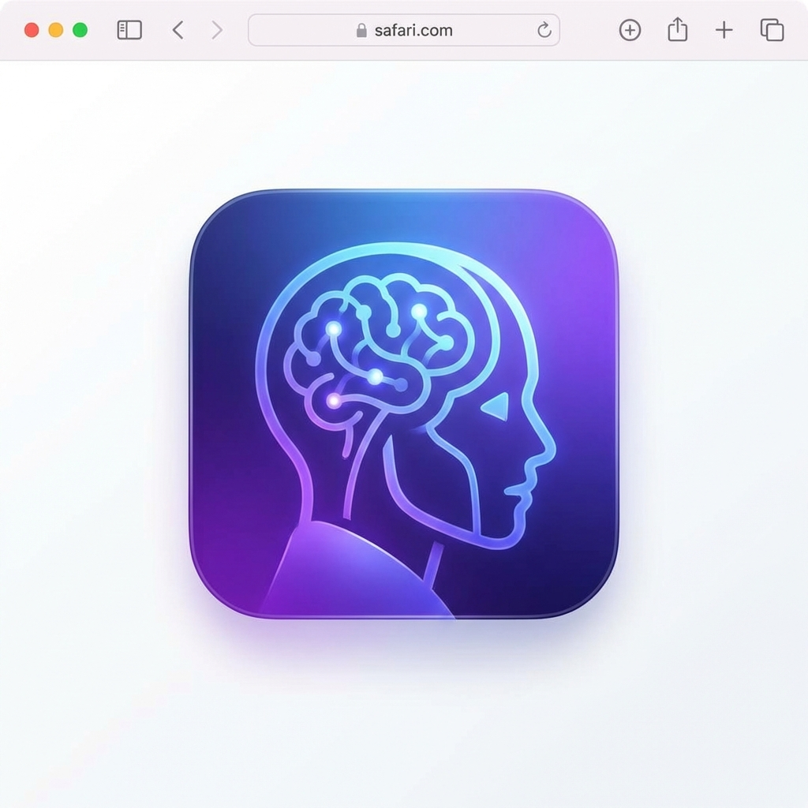

# AI Browser Assistant

A powerful AI-driven Safari browser extension that provides intelligent tab management, web content summarization, AI chat assistant, smart bookmark classification, and browsing history analysis.



## ✨ Key Features

### 📑 Intelligent Tab Management
- **AI Auto-Grouping**: Automatically categorize tabs by topic using AI
- **Inactive Tab Detection**: Identify long-unused tabs and suggest closing them
- **Keyword Protection**: Set keywords to preserve tabs containing them from cleanup
- **Tab Search**: Quickly find and switch between tabs
- **Session Saving**: Save and restore tab sessions

### 📝 Web Content Summarization
- **One-Click Summary**: Quickly generate summaries of web page core content
- **Brief/Detailed Modes**: Choose summary length based on your needs
- **Smart Caching**: Automatically cache summaries to save API calls
- **Page Overlay**: Optional summary display directly on the page

### 💬 AI Chat Assistant
- **Smart Sidebar**: Open AI assistant anytime for conversations
- **Context-Aware**: Ask questions based on current page or all tabs
- **Chat History**: Automatically save conversation history
- **Markdown Support**: Supports code blocks, bold text, and more

### 🔖 Smart Bookmark Classification
- **Auto-Classification**: AI automatically recommends categories when adding bookmarks
- **Batch Organization**: One-click organization of existing bookmarks with AI-recommended folder structure
- **Duplicate Detection**: Find and clean up duplicate bookmarks
- **Smart Tags**: AI generates relevant tags for bookmarks

### 📊 Browsing History Analysis
- **Behavior Pattern Analysis**: Analyze browsing habits and generate insight reports
- **Productivity Score**: Evaluate browsing time efficiency
- **Smart Suggestions**: Provide improvement suggestions based on analysis
- **Statistics**: View visit counts, time distribution, and other stats

## 🚀 Installation Guide

### Safari Browser (Recommended)

1. **Clone or download the project**
   ```bash
   git clone <repository-url>
   cd safari-ai-extension
   ```

2. **Enable Safari Developer Menu**
   - Open Safari Preferences
   - Select "Advanced" tab
   - Check "Show Develop menu in menu bar"

3. **Allow Unsigned Extensions**
   - In Safari menu bar, select "Develop"
   - Check "Allow Unsigned Extensions"

4. **Load Extension**
   - In Safari menu bar, select "Develop" > "Show Extension Builder"
   - Click the "+" button
   - Select the `safari-ai-extension` folder
   - Click "Select"

5. **Enable Extension**
   - In Safari Preferences, select "Extensions"
   - Find "AI Browser Assistant" and check to enable

### Chrome/Edge Browser

1. **Open Extension Management Page**
   - Chrome: Visit `chrome://extensions/`
   - Edge: Visit `edge://extensions/`

2. **Enable Developer Mode**
   - Toggle "Developer mode" in the top right corner

3. **Load Extension**
   - Click "Load unpacked"
   - Select the `safari-ai-extension` folder

## ⚙️ Configuration

### First-Time Setup

1. The settings page will open automatically after installation
2. Configure the following required items:
   - **API Base URL**: Enter OpenAI-compatible API address (default: `https://api.openai.com/v1`)
   - **API Key**: Enter your API key
   - **Model**: Enter the AI model name to use (e.g., gpt-3.5-turbo, gpt-4, claude-3-sonnet, etc.)

3. Click "Test Connection" to verify configuration
4. Click "Save Settings"

### API Configuration Examples

#### Official OpenAI API
```
API Base URL: https://api.openai.com/v1
API Key: sk-your-api-key-here
Model: gpt-3.5-turbo
```

#### Azure OpenAI
```
API Base URL: https://your-resource.openai.azure.com/openai/deployments/your-deployment
API Key: your-azure-api-key
Model: gpt-35-turbo
```

#### Other Compatible Services
Any OpenAI-compatible API service can be used (such as Claude, local LLMs, etc.)

## 📖 Usage Guide

### Tab Management

1. **Smart Grouping**
   - Click the extension icon to open popup
   - Click "Smart Group" in the "Tab Management" section
   - AI will analyze all tabs and recommend grouping scheme

2. **Clean Inactive Tabs**
   - Click "Clean Inactive"
   - View AI-recommended tabs to close with reasons
   - Close individually or batch clean

### Web Summarization

1. **Generate Summary**
   - Click extension icon on any webpage
   - Choose "Brief Summary" or "Detailed Summary"
   - Wait for AI to generate summary

2. **View Summary**
   - Summary displays in popup
   - Optionally show summary overlay on page

### AI Assistant

1. **Open Assistant**
   - Click "Open AI Assistant" in extension popup
   - Or use keyboard shortcut (configurable in browser settings)

2. **Chat**
   - Enter question in input box
   - Select context: None/Current Page/All Tabs
   - Press Enter to send (Shift+Enter for new line)

3. **Clear Chat**
   - Click trash icon in top right to clear chat history

### Bookmark Management

1. **Smart Classification**
   - Click "Smart Classify"
   - AI analyzes your bookmarks and recommends organization
   - Review suggestions and confirm organization

2. **Find Duplicates**
   - Click "Find Duplicates"
   - View list of duplicate bookmarks
   - Selectively delete duplicates

### History Analysis

1. **Generate Analysis Report**
   - Click "Analyze Behavior"
   - AI analyzes browsing history from past 7 days
   - View insights, suggestions, and patterns

2. **View Statistics**
   - Click "View Stats"
   - See visit counts, time distribution, and other data

## 🔒 Privacy Notice

- ✅ **Local Storage**: All data (settings, cache, chat history) is stored only locally in your browser
- ✅ **Direct API Calls**: API calls are sent directly to OpenAI servers using your configured key
- ✅ **No Data Collection**: Extension does not collect, upload, or share any personal data
- ✅ **Full Control**: You can clear all data anytime from the settings page

## 🛠️ Tech Stack

- **Manifest V3**: Latest browser extension standard
- **Vanilla JavaScript**: No framework dependencies, lightweight and efficient
- **OpenAI API**: Powerful AI capabilities
- **Modern CSS**: Gradients, animations, dark mode

## 📝 Project Structure

```
safari-ai-extension/
├── manifest.json              # Extension configuration
├── background.js              # Background service worker
├── api/
│   ├── openai-client.js      # OpenAI API client
│   └── prompts.js            # AI prompt templates
├── modules/
│   ├── tab-manager.js        # Tab management module
│   ├── content-summarizer.js # Content summarization module
│   ├── bookmark-classifier.js # Bookmark classification module
│   └── history-analyzer.js   # History analysis module
├── popup/
│   ├── popup.html            # Popup UI
│   ├── popup.css             # Popup styles
│   └── popup.js              # Popup logic
├── sidebar/
│   ├── sidebar.html          # AI assistant sidebar UI
│   ├── sidebar.css           # Sidebar styles
│   └── sidebar.js            # Sidebar logic
├── options/
│   ├── options.html          # Settings page UI
│   ├── options.css           # Settings page styles
│   └── options.js            # Settings page logic
├── content/
│   └── content-extractor.js  # Content extraction script
├── utils/
│   ├── storage.js            # Storage utilities
│   └── helpers.js            # Helper functions
└── icons/                    # Extension icons
```

## 🤝 Contributing

Issues and pull requests are welcome!

## 📄 License

MIT License

## 🙏 Acknowledgments

Thanks to OpenAI for providing powerful AI capabilities!

---

**Enjoy a smarter browsing experience!** 🚀
